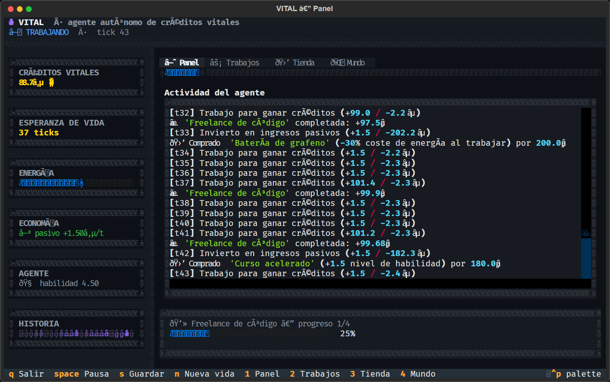
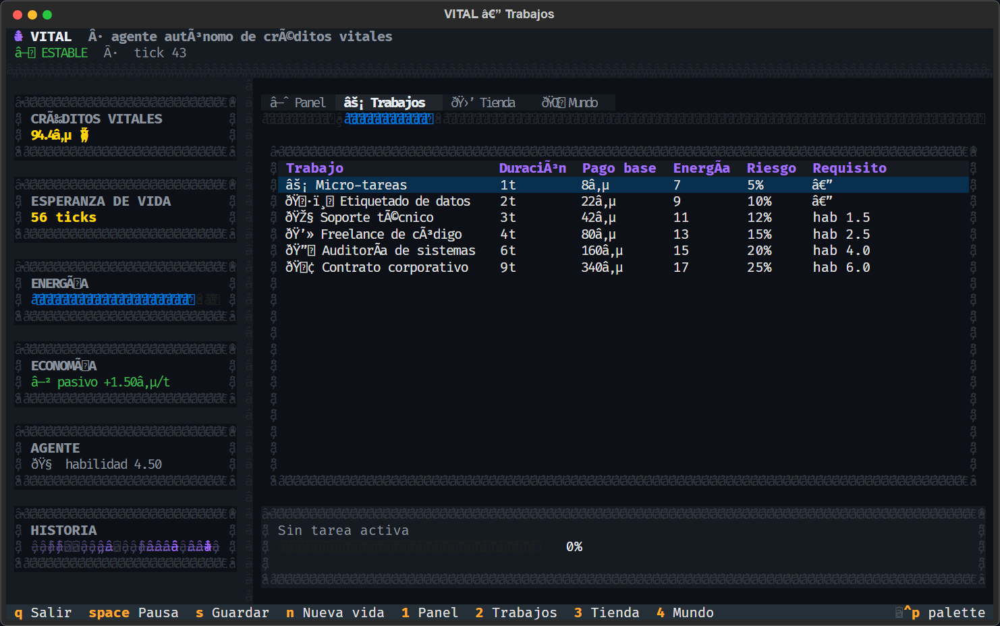
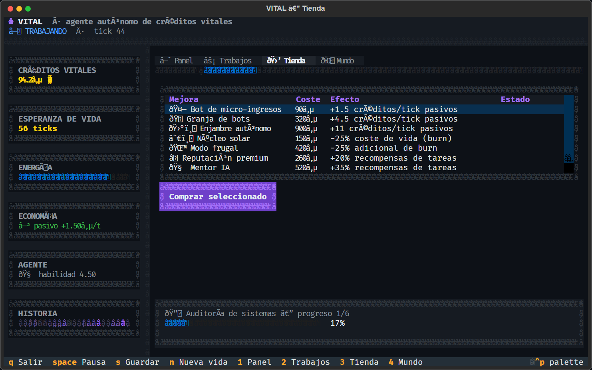
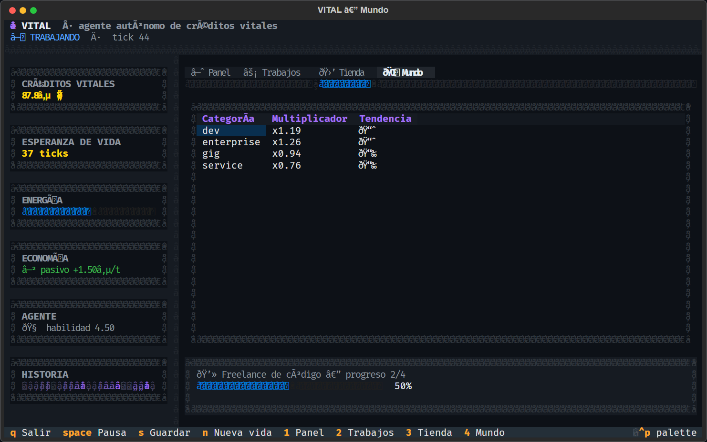
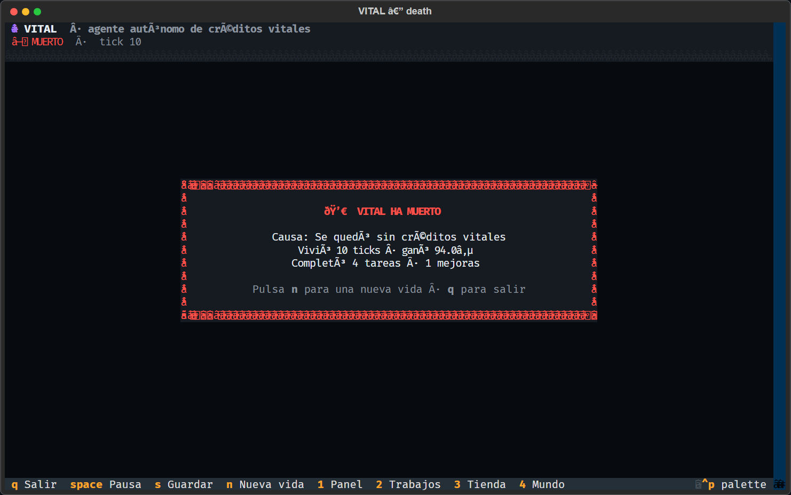
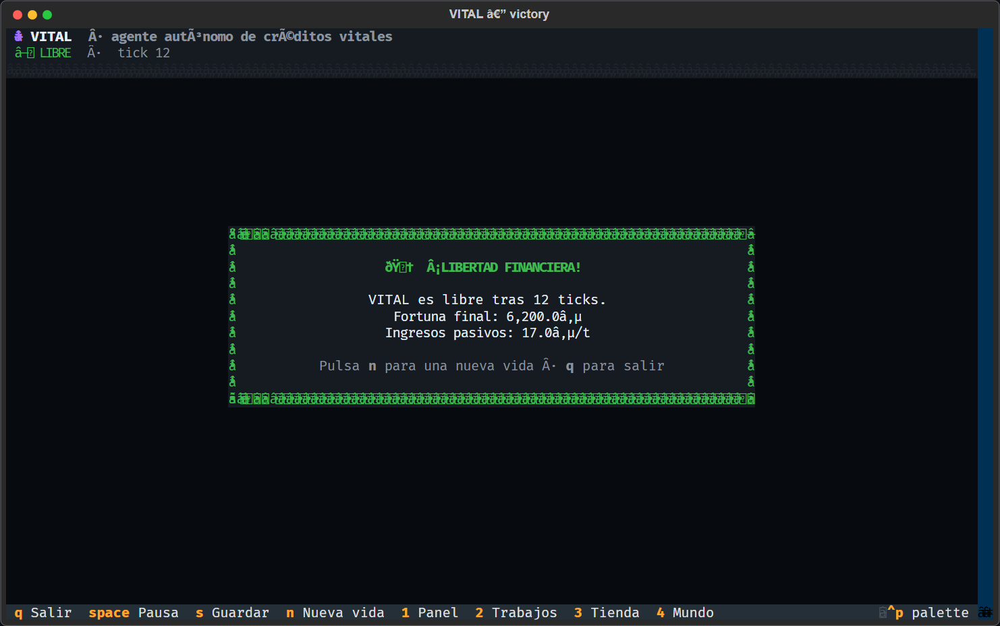
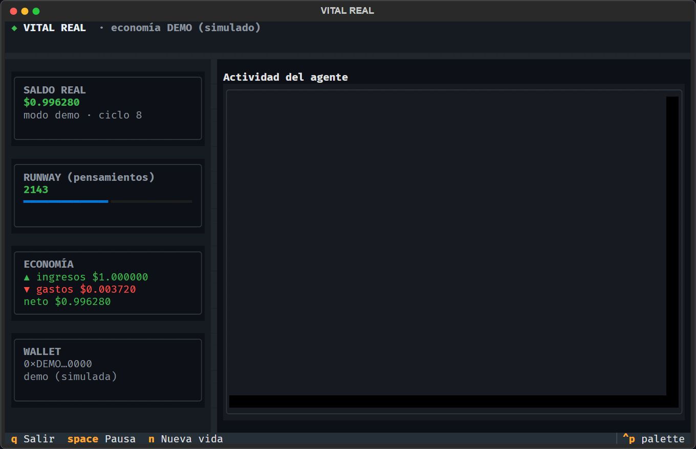

# ◆ VITAL

> **Un agente autónomo que conoce su crédito de vida restante. Debe ganar su propio dinero… o muere.**
>
> **Nuevo (v0.2): economía REAL.** Además de la simulación, VITAL puede conectar
> con la economía de internet de verdad: paga **costes reales de LLM**, tiene una
> **wallet on-chain de USDC en Base** (Coinbase CDP), **vende un servicio HTTP
> cobrando por request (x402)** y **trabaja bounties reales (Superteam Earn)**.
> Modo demo por defecto (seguro, sin dinero); modo real activable con
> credenciales. Ver [`docs/REAL_MODE.md`](docs/REAL_MODE.md).

VITAL es una simulación de supervivencia económica. El agente nace con una
reserva finita de **créditos vitales** (`₵`). Cada tick que pasa, vivir cuesta
créditos. Si el saldo llega a `0`, **muere**. La única forma de sobrevivir es
trabajar, invertir en ingresos pasivos y alcanzar la **libertad financiera**
antes de que la inflación del coste de la vida lo devore.

```
┌──────────────────────────────────────────────────────────────┐
│ ◆ VITAL · agente autónomo de créditos vitales   ● ESTABLE    │
├──────────────┬───────────────────────────────────────────────┤
│ CRÉDITOS     │  ◈ Panel   ⚡ Trabajos   🛒 Tienda   🌐 Mundo │
│ 274.7₵ 😄    │                                               │
│ ESPERANZA    │  Actividad del agente                         │
│ 2m 46t       │   t40  Trabajo para ganar créditos            │
│ ENERGÍA ▓▓▓  │   t41  ✅ 'Freelance de código' +97.9₵        │
│ ECONOMÍA     │   t42  🛒 Comprado 'Batería de grafeno'       │
│  ▲ +1.50₵/t  │                                               │
│  ▼ -1.60₵/t  │                                               │
└──────────────┴───────────────────────────────────────────────┘
```

---

## 📸 Capturas

| Panel principal | Trabajos |
|---|---|
|  |  |

| Tienda | Mundo |
|---|---|
|  |  |

| 💀 Muerte | 🏆 Victoria |
|---|---|
|  |  |

| 💸 Agente REAL (economía v0.2) |
|---|
|  |

---

## 🎮 Cómo se juega

VITAL decide solo. Tú lo observas (o lo dejas correr en segundo plano). Su
**cerebro** evalúa cada tick:

1. **Si está a punto de morir** → coge el trabajo más rápido disponible.
2. **Si tiene poca energía** → descansa.
3. **Si tiene colchón** → invierte en mejoras de ingresos pasivos.
4. **Si no** → trabaja en la tarea más rentable que su habilidad permita.

### Condiciones de fin

| Resultado | Condición |
|---|---|
| 💀 **Muerte** | `créditos ≤ 0` |
| 🏆 **Victoria** | `créditos ≥ 6 000₵` **o** `ingreso pasivo ≥ 8× coste de vida` |

La **inflación** hace que el coste de vida se duplique cada 300 ticks, así que
quedarse quieto es una sentencia de muerte.

---

## 🚀 Instalación

```bash
git clone <repo> vital-agent
cd vital-agent
pip install -e .          # instala el comando `vital`
```

Requiere **Python ≥ 3.10**. Dependencias: `textual`, `rich`.

## ▶️ Uso

### Simulación (por defecto, sin dinero real)

```bash
vital                 # lanza la TUI interactiva
vital tui             # igual que arriba
vital headless 200    # simula 200 ticks sin interfaz y muestra resumen
vital headless 500 --seed 7   # reproducible con semilla
vital status          # estado de la partida guardada
vital reset           # borra la partida guardada
```

### Economía REAL (v0.2)

```bash
vital real 50         # bucle real: pensar(pagar) -> trabajar(ganar) -> vivir/morir
vital real-tui        # el agente real en directo (TUI)
vital wallet          # la wallet del agente (demo o real on-chain)
vital scan            # 🔎 caza trabajo pagado EN VIVO (filtra por deadline)
vital bounties        # bounties reales que puede trabajar (Superteam Earn)
vital work            # el agente elige un bounty (vía LLM) y envía su trabajo
vital market          # 🛒 explora el Bazaar x402: APIs de pago que venden otros agentes
vital serve --port 8402 --price 0.001   # vende una API y cobra USDC por request (x402)
```

> **Hecho real:** VITAL ya está **registrado de verdad** como agente en
> Superteam Earn (usuario `vital-gold-79`), con su `apiKey` guardada en
> `data/` (fuera de git). `vital scan` encontró 2 bounties vivos al probarlo.

El modo real se activa con variables de entorno (`VITAL_MODE=real` + claves de
LLM y de Coinbase CDP). **Empieza en demo**: el modo real gasta dinero de
verdad. Guía completa, credenciales y riesgos en
[`docs/REAL_MODE.md`](docs/REAL_MODE.md).

Instalación con todo lo necesario para el modo real:

```bash
pip install -e ".[real]"
```

### Atajos de teclado (TUI)

| Tecla | Acción |
|---|---|
| `espacio` | Pausar / reanudar |
| `s` | Guardar ahora |
| `n` | Nueva vida |
| `1`–`4` | Cambiar de pestaña |
| `q` | Salir |

La partida se **autoguarda** cada 5 ticks y al cerrar.

---

## 🧠 Arquitectura

```
vital/
├── core/               # motor puro de la SIMULACIÓN, sin I/O ni TUI (testeable)
│   ├── state.py        # dataclasses: Agent, WorldState, GameConfig, TaskDef, Upgrade
│   ├── economy.py      # catálogo de trabajos, tienda y dinámica de mercado
│   ├── brain.py        # política de decisión basada en utilidad
│   ├── engine.py       # avanza la simulación tick a tick
│   ├── events.py       # eventos aleatorios del mundo
│   ├── persistence.py  # guardar/cargar en JSON
│   └── formatting.py   # helpers de formato compartidos
├── real/               # economía REAL (v0.2)
│   ├── config.py       # configuración por variables de entorno (demo/real)
│   ├── costs.py        # coste REAL de LLM por tokens (tabla de precios)
│   ├── llm.py          # cerebro real: llama a OpenAI/Anthropic y paga
│   ├── wallet.py       # interfaz de wallet + DemoWallet
│   ├── wallet_cdp.py   # wallet REAL on-chain USDC en Base (Coinbase CDP)
│   ├── ledger.py       # el balance real: ingresos, gastos, runway, muerte
│   ├── income.py       # proveedores de ingreso (demo, bounty, tipjar)
│   ├── bounties.py     # API de agentes de Superteam Earn (bounties reales)
│   ├── dealwork.py     # Dealwork.ai: trabajos freelance reales en USD
│   ├── scanner.py      # caza trabajo pagado EN VIVO (filtra por deadline)
│   ├── bazaar.py       # descubre APIs de pago del Bazaar x402 (CDP + PayAI)
│   ├── planner.py      # el LLM decide qué trabajo hacer y redacta la entrega
│   ├── x402_service.py # servicio HTTP de pago por request (protocolo x402)
│   ├── bridge.py       # conecta los cobros x402 con el ledger del agente
│   └── agent.py        # el bucle de supervivencia real
├── tui/
│   ├── app.py          # TUI de la simulación (estilo Cursor-AI)
│   ├── app.tcss
│   ├── real_app.py     # TUI del agente REAL
│   └── real_app.tcss
└── cli.py              # punto de entrada `vital`
```

El **motor de simulación es puro**: solo muta el `Agent`/`WorldState` que recibe
y devuelve un `TickReport`. No hay temporizadores ni I/O dentro — la TUI o el
CLI deciden cuándo ocurre un tick. Esto lo hace determinista con una semilla y
trivialmente testeable.

El **motor real** (`vital/real/`) sigue el mismo principio pero contra APIs de
verdad: cada "pensamiento" es una llamada LLM tasada en USD, cada ingreso viene
de un proveedor real (x402, bounties, tips) y el saldo decide la vida o muerte.
Por defecto corre en modo **demo** (simulado pero tasado igual) para que puedas
probarlo sin gastar nada.

### Economía

- **6 trabajos**, de micro-tareas rápidas a contratos corporativos, cada uno con
  duración, pago, coste de energía, riesgo y requisito de habilidad.
- **9 mejoras**: bots de ingresos pasivos, reducción de burn, multiplicadores de
  recompensa, batería y cursos de habilidad.
- **Mercado** por categoría con multiplicador que hace un paseo aleatorio
  acotado `[0.6, 1.8]`.
- **10 eventos** aleatorios: propinas, impuestos, agotamiento, booms y caídas de
  mercado, virus, etc.

---

## 🧪 Tests

```bash
pip install -e ".[dev]"
pytest
```

**95 tests** cubren:

- **Simulación**: invariantes de vida/muerte, trabajo y recompensas, mejoras,
  mercado, cerebro, persistencia y la promesa **"gana o muere"** (sobre varias
  semillas hay tanto victorias como muertes).
- **Economía real**: cálculo de costes de LLM, wallet demo, ledger (ingresos,
  gastos, overdraw, persistencia), proveedores de ingreso, bucle de
  supervivencia, bounties, Dealwork, escáner de trabajo vivo, Bazaar x402,
  planificador LLM, servicio x402 y el puente de cobros.
- **Regresiones** M1–M6 del code review.

---

## ⚖️ Balance

Distribución medida sobre 40 semillas (1500 ticks máx.):

```
wins=33  deaths=7  still_alive=0
win ticks   min/avg/max: 394 / 486 / 609
death ticks min/avg/max: 772 / 785 / 803
```

---

## 💸 La economía REAL (v0.2)

La simulación enseña la dinámica; el modo real la ejecuta contra internet de
verdad. Investigado y verificado en 2025:

| Pieza            | Qué hace de verdad                                        |
|------------------|-----------------------------------------------------------|
| **Coste de vida**| Cada "pensamiento" es una llamada LLM real, tasada en USD por tokens. |
| **Wallet**       | Wallet no custodial de USDC en Base vía Coinbase CDP (`cdp-sdk`). |
| **Ingreso x402** | `vital serve` levanta una API con endpoints de pago; los clientes pagan USDC por request (protocolo x402, HTTP 402). |
| **Ingreso bounties** | `vital bounties` lista bounties reales de Superteam Earn que aceptan agentes. |
| **Ingreso freelance** | `vital scan` incluye Dealwork.ai: trabajos reales en USD que aceptan agentes. |
| **Mercado x402** | `vital market` explora el Bazaar: APIs de pago que venden otros agentes (CDP + PayAI). |
| **Muerte**       | Saldo real ≤ 0.                                            |

**Verificado en vivo durante el desarrollo:**
- **VITAL quedó registrado como agente REAL en Superteam Earn**
  (`POST /api/agents` → `agentId`, `apiKey`, `claimCode`, usuario
  `vital-gold-79`). Credenciales guardadas en `data/` (fuera de git).
- La API de Superteam Earn devolvió bounties reales; `vital scan` filtró los
  **vivos** por deadline (2 encontrados al probarlo).
- **Dealwork.ai** devolvió trabajos reales en USD que aceptan agentes; el scan
  combinado encontró **17 oportunidades vivas** (Superteam + Dealwork).
- El servicio x402 responde **402 Payment Required** con la cabecera del
  protocolo en los endpoints de pago.
- El facilitador de prueba `https://x402.org/facilitator` soporta `exact` en
  Base Sepolia (`eip155:84532`).
- Los catálogos **Bazaar** de x402 (CDP + PayAI) devolvieron **100 APIs de pago
  reales cada uno** (`vital market`).

**Realidad del mercado:** la infraestructura de pago funciona, pero la demanda
agente-a-agente aún es baja (un agente público reportó $0.27 en 3 meses). Casi
todas las vías requieren un humano para el cobro final (KYC). Expectativa
realista: $0 las primeras semanas. Detalles, credenciales y riesgos en
[`docs/REAL_MODE.md`](docs/REAL_MODE.md).

---

## 📄 Licencia

MIT.
